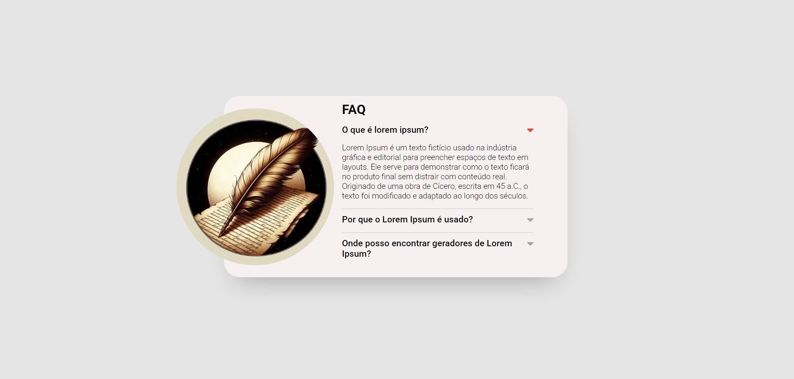
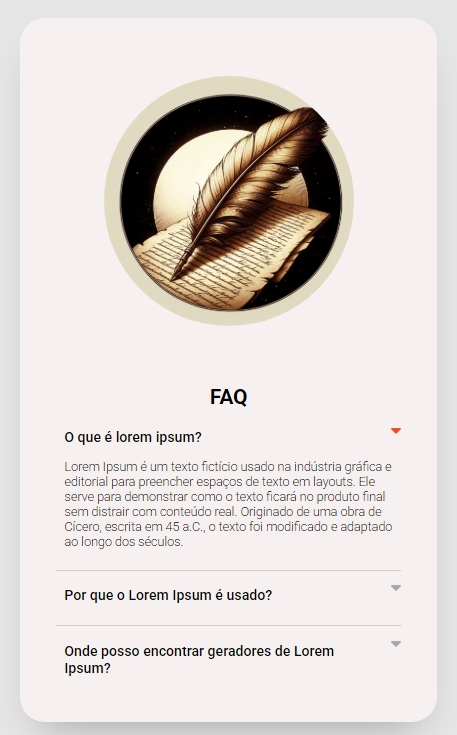

# 📂 Projeto Acordeon

Este é um projeto de um componente de acordeon responsivo, desenvolvido com **HTML, CSS e JavaScript**. O objetivo é criar uma interface intuitiva para exibir e esconder conteúdos de forma organizada.

## 🚀 Demonstração

🔗 **Acesse o projeto aqui**: [Acordeon Lorem Responsivo](https://milaregner.github.io/acordeon-lorem-responsivo/)


## 🚀 Tecnologias Utilizadas

- **HTML** → Estrutura do acordeon
- **CSS** → Estilização e responsividade
- **JavaScript** → Funcionalidade de abrir e fechar os itens do acordeon

## 🎨 Layout e Responsividade

O projeto foi desenvolvido com foco na experiência do usuário, garantindo um design agradável e adaptável a diferentes tamanhos de tela, incluindo dispositivos móveis.

## 📌 Funcionalidades

✅ Expande e recolhe respostas ao clicar nas perguntas  
✅ Totalmente responsivo para diferentes tamanhos de tela  
✅ Animação suave na abertura e fechamento  

---

### 🖥️ Desktop
✅ Layout com imagem à esquerda e conteúdo ao lado.

### 📱 Mobile
✅ Imagem posicionada no topo, com o conteúdo abaixo.

## 📌 Como Usar

1. Clone este repositório:
   ```sh
   git clone https://github.com/milaregner/acordeon-lorem-responsivo.git
   ```
2. Abra o arquivo `index.html` em seu navegador.
3. Clique nas perguntas para expandir e visualizar as respostas.

## 📷 Capturas de Tela

| Desktop | Mobile |
|---------|--------|
|  |  |


---

## 🔧 Melhorias Futuras

- [ ] Adicionar efeitos visuais aprimorados  
- [ ] Permitir múltiplos acordes abertos simultaneamente  
- [ ] Melhorar a acessibilidade para leitores de tela  


## 💜 Criado por

Feito com 💜 por [@Milaregner](https://github.com/Milaregner).  
Se gostou do projeto, deixe uma ⭐ no repositório!

---

💡 *Sugestões e melhorias são sempre bem-vindas!*
